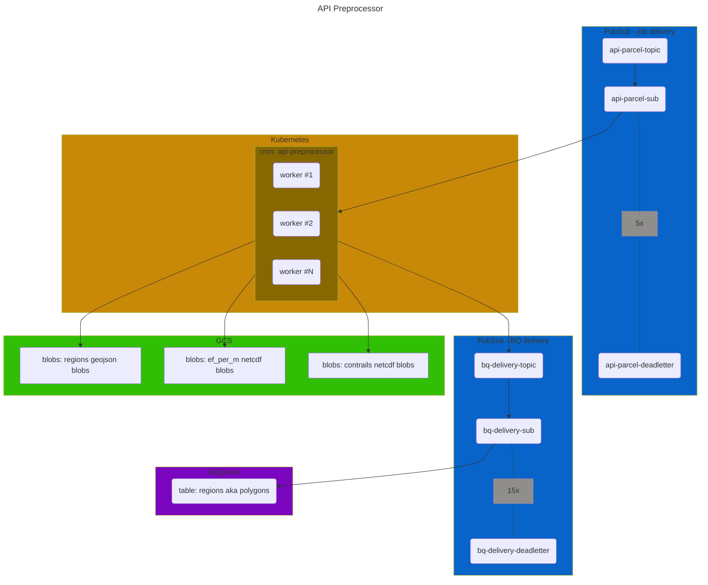

# api-preprocessor

## Overview
The API Preprocessor runs the [pycontrails](https://py.contrails.org/) CoCiP grid model on HRES meteorological forecasts,
and persists the contrail predictions as static assets in Google Cloud Storage (GCS) and BigQuery (BQ).
The static assets written to GCS back the [`v1` routes](https://api.contrails.org/openapi#/Production%20(beta)) 
of the [pycontrails API](https://apidocs.contrails.org/#production-api-beta).

## Behavior
The API Preprocessor is a Dockerized python application designed to be a worker service
which concurrently consumes jobs from a job queue.

A "job" is an `ApiPreprocessorJob`, and defined in [lib/schemas.py](lib/schemas.py).
A job fully defines the work to be done by a single invocation of the API Preprocessor:
- `model_run_at`: unix time at which model was executed
- `model_predicted_at`: unix time at which model predicts outputs quantities
- `flight_level`: the flight level for this job's unit of work
- `aircraft_class`: the string literal defining the aircraft class

`model_run_at` defines the target HRES data source to use for running CoCiP.
Every six hours, ECMWF runs the HRES forecast model. The time at which this model is run
is the `model_run_at` time.  HRES data is stored in a `.zarr` store in GCS (the output of the HRES ETL pipeline),
and each `.zarr` store corresponds to a single `model_run_at` time 
(i.e. each zarr store holds 73 hours of data for the 72hrs of forecast past `model_run_at`).

`model_predicted_at` defines the target timestamp for running CoCiP .
It is expected that `model_predicted_at` occurs on or after `model_run_at`,
occurring no greater than 72 hours past `model_run_at` 
(ECMWF provides meteorological forecasts 72 hours past `model_predicted_at` for a given model run).

The acceptable elapsed time between `model_run_at` and `model_predicted_at` is further constrained
by a maximum assumed age for contrail evolution. 
For reference, see `ValidationHandler.sufficient_forecast_range()` in [lib/handlers.py](lib/handlers.py).

`flight_level` defines the flight level on which to calculate the CoCiP grid.
The API Preprocessor may also be directed to run across all flight levels,
if the `ApiPreprocessor.flight_level` parameter is set to the 
`ApiPreprocessor.ALL_FLIGHTS_LEVEL_WILDCARD`, then the API Preprocessor will
run CoCiP across all flight levels.  The determination to run the API Preprocessor
on a single fl or across all fls depends on how the implementer wishes to manage
concurrency when implementing the API Preprocessor in-system.
Note that the resource configuration (memory, vCPU) defined in the [service's k8s yaml](helm/templates/api-preprocessor-cronjob.yaml)
are currently set assuming the API Preprocessor is running across all flight levels 
(i.e, it is currently set to higher memory and vCPU settings than if it were running on single fls).

`aircraft_class` defines the friendly-name identifier for the aircraft configuration to use
when running CoCiP (passed to the aircraft performance model).
At present, three aircraft classes are defined, each mapping to an aircraft body type and engine type.
See `ApiPreprocessorJob.AIRCRAFT_CLASSES` in [schemas.py](lib/schemas.py).

## Environment Variables
The following environment variables are expected for production and development environments.

| name                              |                                                description                                                |
|:----------------------------------|:---------------------------------------------------------------------------------------------------------:|
| SOURCE_PATH                       |                       fully-qualified file path for HRES pressure-level zarr stores                       |
| SINK_PATH                         |                      fully-qualified file path prefix for writing output data assets                      |
| API_PREPROCESSOR_SUBSCRIPTION_ID  | fully-qualified uri for the pubsub subscription for api-preprocessor jobs (generated by the hres-etl svc) |
| COCIP_REGIONS_BQ_TOPIC_ID         |        fully-qualified uri for the pubsub topic that injects records to the bigquery regions table        |
| API_PREPROCESSOR_SUBSCRIPTION_ACK_EXTENSION_SEC                         |                         extension period for subscriber message lease management                          |
| LOG_LEVEL                         |                                    log level for service in production                                    |

## Infra
The infrastructure components supporting this service are codified in Terraform and located in [.cloud](.cloud).
This includes, but is not limited, to the following resources:
- GCP PubSub topics and subscriptions
- GCP BigQuery datasets and tables
- GCP Google Cloud Storage buckets
- GCP Kubernetes namespaces and k8s service accounts
- GCP IAM (service accounts, roles, bindings)

Infra resources are managed manually via terraform 
(infra state/changes are _not_ integrated into CICD triggers).

Note that access control between applications running in K8s and other GCP resources
is managed using a GCP IAM service account <-> K8s service account binding (i.e. GCP's Workload Identity Federation).

Note that services we deploy _inside_ k8s are not managed via Terraform, rather via CICD (GitHub Actions) and Helm.
See the k8s yaml manifest defining this service (CronJob and Pod spec) in [api-preprocessor-cronjob.yaml](helm/templates/api-preprocessor-cronjob.yaml).

## CICD
Merges to the `develop` branch build and deploy this service to the dev environment,
consuming jobs from a pubsub subscription and writing output assets to a gcs path/pubsub topic as defined
in the environment variables of [`deploy-dev.yaml`](.github/workflows/deploy-dev.yaml).

Merges to the `main` branch similarly deploy this service to the prod environment.
See [`deploy-main.yaml](.github/workflows/deploy-prod.yaml).