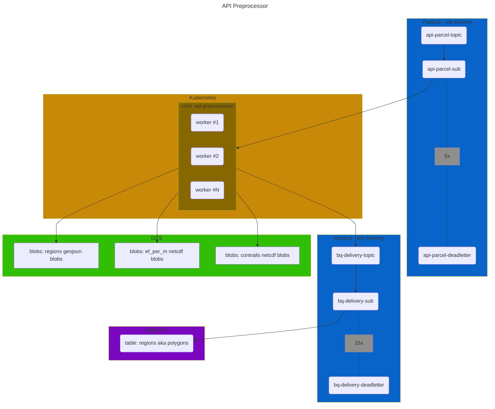

# api-preprocessor

## Overview
The API Preprocessor runs the [pycontrails](https://py.contrails.org/) CoCiP grid model on HRES meteorological forecasts,
and persists the contrail predictions as static assets in Google Cloud Storage (GCS) and BigQuery (BQ).
The static assets written to GCS back the [`v1` routes](https://api.contrails.org/openapi#/Production%20(beta)) 
of the [pycontrails API](https://apidocs.contrails.org/#production-api-beta).

## Behavior
The API Preprocessor is a Dockerized python application designed to be a worker service
which concurrently consumes jobs from a job queue.

### Unit of Work
A "job" is an `ApiPreprocessorJob`, and defined in [lib/schemas.py](lib/schemas.py).
A job fully defines the work to be done by a single invocation of the API Preprocessor:
- `model_run_at`: unix time at which model was executed
- `model_predicted_at`: unix time at which model predicts outputs quantities
- `flight_level`: the flight level for this job's unit of work
- `aircraft_class`: the string literal defining the aircraft class

`model_run_at` defines the target HRES data source to use for running CoCiP.
Every six hours, ECMWF runs the HRES forecast model. The time at which this model is run
is the `model_run_at` time.  HRES data is stored in a `.zarr` store in GCS (the output of the HRES ETL pipeline),
and each `.zarr` store corresponds to a single `model_run_at` time 
(i.e. each zarr store holds 73 hours of data for the 72hrs of forecast past `model_run_at`).

`model_predicted_at` defines the target timestamp for running CoCiP .
It is expected that `model_predicted_at` occurs on or after `model_run_at`,
occurring no greater than 72 hours past `model_run_at` 
(ECMWF provides meteorological forecasts 72 hours past `model_predicted_at` for a given model run).

The acceptable elapsed time between `model_run_at` and `model_predicted_at` is further constrained
by a maximum assumed age for contrail evolution. 
For reference, see `ValidationHandler.sufficient_forecast_range()` in [lib/handlers.py](lib/handlers.py).

`flight_level` defines the flight level on which to calculate the CoCiP grid.
The API Preprocessor may also be directed to run across all flight levels,
if the `ApiPreprocessor.flight_level` parameter is set to the 
`ApiPreprocessor.ALL_FLIGHTS_LEVEL_WILDCARD`, then the API Preprocessor will
run CoCiP across all flight levels.  The determination to run the API Preprocessor
on a single fl or across all fls depends on how the implementer wishes to manage
concurrency when implementing the API Preprocessor in-system.
Note that the resource configuration (memory, vCPU) defined in the [service's k8s yaml](helm/templates/api-preprocessor-cronjob.yaml)
are currently set assuming the API Preprocessor is running across all flight levels 
(i.e, it is currently set to higher memory and vCPU settings than if it were running on single fls).

`aircraft_class` defines the friendly-name identifier for the aircraft configuration to use
when running CoCiP (passed to the aircraft performance model).
At present, three aircraft classes are defined, each mapping to an aircraft body type and engine type.
See `ApiPreprocessorJob.AIRCRAFT_CLASSES` in [schemas.py](lib/schemas.py).

### Execution Logic
The API Preprocessor builds and runs the CoCiP grid model based on the input job.

First, the GCS URI for the target HRES zarr store is identified based on the `model_run_at` time
provided in the job.

Next, meteorological datasource objects (`pycontrails.core.met.MetDataset`) are composed based on the target zarr store.

Next, a CoCiP grid object is composed, based on (1) the met datasource objects, (2) aircraft attributes (provided via the `aircraft_class` of the job).

Next, the CoCiP grid model is evaluated, resulting in `ef_per_m` radiative forcing values on a global grid (`lat: [-80, 80], lon: [-180, 180]`) across our standard flight levels (ref: `ApiPreprocessorJob.FLIGHT_LEVELS`).

Next, the CoCiP grid output is augmented with our cross-platform compatible, domain-agnostic, arbitrary-unit: `contrails`.

Next, geoJSON polygons are generated based on various thresholds applied to the `contrails` variable.

Lastly, the output quantities are exported/handled as follows:
1) CoCiP grid netCDF of `ef_per_m` is exported to GCS, ref: `ef_per_m_gids_sink_path` in `main.py:cocip_handler(...)`.
2) CoCiP grid netCDF of `contrails` is exported to GCS, ref: `contrails_grids_sink_path` in `main.py:cocip_handler(...)`.
3) CoCiP polygon geoJSONs at various thresholds are exported to GCS, ref: `regions_sink_path` in `main.py:cocip_handler(...)`.
4) CoCip polygon geoJSONs at various thresholds are published to a PubSub topic (which delivers those blobs to a BigQuery table via a PubSub -> BQ integration).

### System Behavior
The Kubernetes CronJob resource is configured to execute 4 times per day (ref: [api-preprocessor.yaml](helm/templates/api-preprocessor-cronjob.yaml)).
The timing is coordinated with ECMWF delivery, and the execution of the HRES ETL pipeline.
It is assumed that ECMWF grib files are delivered on-time, 
and that a complete zarr store is available for running the queued jobs pending the API Preprocessor CronJob invocation.

See [Failure Modes and Failure Remediation](#failure-modes-and-failure-remediation) for non-happy-path system behavior.

When the API Preprocessor k8s CronJob is invoked, it will spawn some number of Pods corresponding with `jobTemplate.spec.parallelism`.
Each Pod will dequeue a job from the PubSub subscription queue, process the job, write outputs, acknowledge the job, and repeat (until no more jobs are present).
When no more jobs are present, the Pod will exit with a zero code, signaling to the k8s CronJob controller that the (Cron)Job is complete.
It is assumed that when the first pod exits w/ a zero code, that any remaining pods are processing final jobs and will similarly exit successfully shortly thereafter.
See k8s documentation for reference: 
- [Jobs: Parallel Execution of Jobs](https://kubernetes.io/docs/concepts/workloads/controllers/job/#parallel-jobs)
- [Job Patterns](https://kubernetes.io/docs/concepts/workloads/controllers/job/#job-patterns)
- [Fine Parallel Processing Using a Worker Queue](https://kubernetes.io/docs/tasks/job/fine-parallel-processing-work-queue/).

### Failure Modes and Failure Remediation
The Api Preprocessor has the following general failure modes and associated remediation pathways.

#### Case: HRES data unavailable, incomplete or corrupt
Faulty HRES data most often occurs when:
- ECMWF delivery is not on-time
- there is a partial failure in the HRES ETL pipeline
- ECMWF data is corrupt

Cases due to all of the above causes, accept the last, can be remediated.

In this case of faulty HRES data,
a zarr store will be incomplete at the time of an API Preprocessor handling a given job, and
the Pod handling that job is expected to exit with a non-zero code, thereby implicitly n'acked the PubSub message ("job"). 
The message is retried, but ultimately dead-lettered.
The log-based alerting will dispatch an SMS.

*Remediation*
If the zarr store is healed (made available or complete), 
then the dead-lettered jobs can simply be re-injected to the work queue,
and handled on the next invocation of the API Preprocessor.

If healing of the zarr store is not possible, then a data-gap will exist in perpetuity in the output assets.
This should be noted in an Incident Report.

#### Case: CoCip model failure
It may happen from time to time that CoCip fails to run on a given job for CoCiP domain-specific reasons.
This is considered to be a permanent failure.

In this case, the application logs an `ERROR` (and an SMS notification is dispatched),
_but the PubSub message is NOT n'acked_, thereby avoiding a PubSub retry and dead-lettering of the job.
This behavior is by design -- often these failures occur towards the end of a job's execution runtime,
and we want to avoid having the jobs retried multiple times (resulting in a hit to GCP $).
In principle, it would be favorable to n'ack and dead-letter these messages, but GCP PubSub
cannot be configured to retry fewer than 5 times, 
nor can PubSub retry behavior be modulated based on the nature of a failure condition.

*Remediation*
If the nature of CoCip model failure can be remediated with a code fix,
then the failed job(s) can be reconstructed from the log message(s) and re-injected
into the job queue post code-fix.

If the nature of the model failure is not fixable, then the data gap(s) should be noted in an Incident Report.

#### Case: Other
All other failure cases (infrastructure outages, bugs, etc...) should result in either 
the CronJob not executing and draining the worker queue as expected, or,
worker Pods failing to complete work as expected and n'acking/dead-lettering jobs.

In the first case, the work queue will simply continue to grow (with a TTL of 3 days),
and system behavior will return to business as usual once the k8s CronJob resumes happy-path behavior.

In the second case, jobs will be dead-lettered and SMS alert notifications will be sent.
In this case, dead-lettered jobs are re-injected manually (if the failure mode is recoverable),
or, dead-lettered messages are discarded, and the data gap is documented in an Incident Report.

## Environment Variables
The following environment variables are expected for production and development environments.

| name                              |                                                description                                                |
|:----------------------------------|:---------------------------------------------------------------------------------------------------------:|
| SOURCE_PATH                       |                       fully-qualified file path for HRES pressure-level zarr stores                       |
| SINK_PATH                         |                      fully-qualified file path prefix for writing output data assets                      |
| API_PREPROCESSOR_SUBSCRIPTION_ID  | fully-qualified uri for the pubsub subscription for api-preprocessor jobs (generated by the hres-etl svc) |
| COCIP_REGIONS_BQ_TOPIC_ID         |        fully-qualified uri for the pubsub topic that injects records to the bigquery regions table        |
| API_PREPROCESSOR_SUBSCRIPTION_ACK_EXTENSION_SEC                         |                         extension period for subscriber message lease management                          |
| LOG_LEVEL                         |                                    log level for service in production                                    |

## Infra
The infrastructure components supporting this service are codified in Terraform and located in [.cloud](.cloud).
This includes, but is not limited, to the following resources:
- GCP PubSub topics and subscriptions
- GCP BigQuery datasets and tables
- GCP Google Cloud Storage buckets
- GCP Kubernetes namespaces and k8s service accounts
- GCP IAM (service accounts, roles, bindings)
- Alerts (log and metric based alerts, with SMS notifications)

Infra resources are managed manually via terraform 
(infra state/changes are _not_ integrated into CICD triggers).

Note that access control between applications running in K8s and other GCP resources
is managed using a GCP IAM service account <-> K8s service account binding (i.e. GCP's Workload Identity Federation).

Note that services we deploy _inside_ k8s are not managed via Terraform, rather via CICD (GitHub Actions) and Helm.
See the k8s yaml manifest defining this service (CronJob and Pod spec) in [api-preprocessor-cronjob.yaml](helm/templates/api-preprocessor-cronjob.yaml).

## CICD
Merges to the `develop` branch build and deploy this service to the dev environment,
consuming jobs from a pubsub subscription and writing output assets to a gcs path/pubsub topic as defined
in the environment variables of [`deploy-dev.yaml`](.github/workflows/deploy-dev.yaml).

Merges to the `main` branch similarly deploy this service to the prod environment.
See [`deploy-main.yaml](.github/workflows/deploy-prod.yaml).